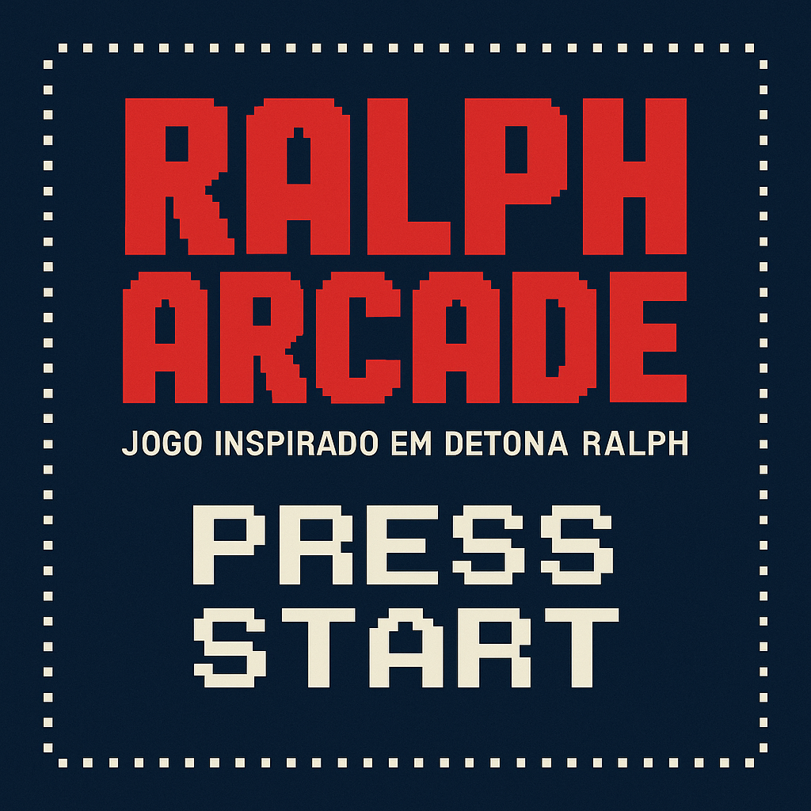
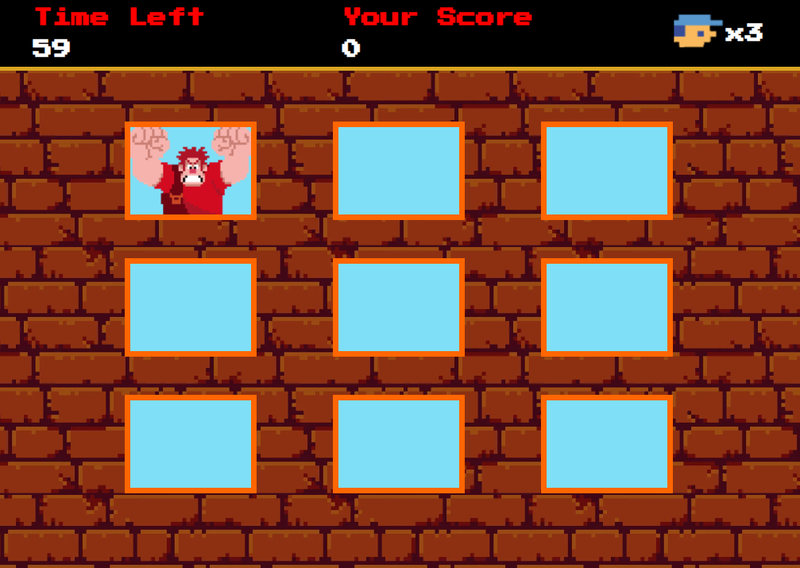

# 🎮 Ralph Arcade - Jogo inspirado em Detona Ralph

  

## 🚀 Tecnologias usadas

  
  
  

---

## 🧠 O que eu pratiquei

- Organização de arquivos e pastas em um projeto web
- Manipulação de elementos com JavaScript
- Estilização com CSS, incluindo Flexbox
- Aplicação de fontes externas com Google Fonts

---

## 🖥️ Preview do Jogo

  

---
## 🕹️ Como Jogar
1. Clique na janela onde o Ralph aparecer.
2. A cada acerto você ganha 1 ponto.
3. Se clicar em uma janela errada você perde 1 vida.
4. O jogo termina quando o tempo acabar ou se você perder todas as vidas.
5. No final, será exibida sua pontuação total em um alerta.

> 💡[Clique aqui para jogar online](https://mirellanovroch.github.io/detona-ralph-game-project/)

> 📌 Este projeto ainda está em desenvolvimento e continuará recebendo melhorias conforme avanço nos meus estudos.

---
## ✨ Créditos
Este jogo foi desenvolvido como parte de um projeto educacional da [Digital Innovation One](https://www.dio.me/).
